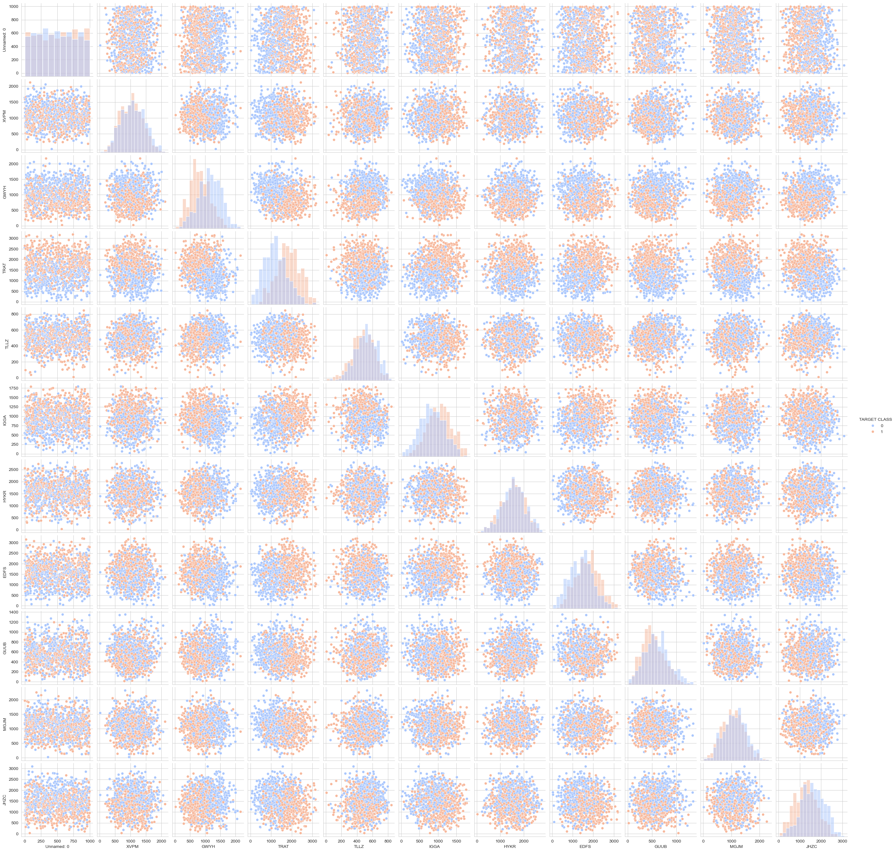

# 🚀 K-Nearest Neighbors (KNN) Classification Project

---

## 🔍 Project Overview

This project applies the **K-Nearest Neighbors (KNN)** algorithm to classify data based on feature similarity. The model predicts the target class by identifying the nearest data points in the feature space.

The objective is to evaluate and improve model performance using preprocessing techniques, hyperparameter tuning, and visualization.

---

## 📊 Dataset Information

* 📁 **Dataset:** `KNN_Project_Data.csv`
* 🔢 **Observations:** 1000+ rows
* 📌 **Features:** Multiple numerical variables
* 🎯 **Target Variable:** `TARGET CLASS` (Categorical)

---

## 🧹 Data Preprocessing

* ✔ Checked for missing values
* ✔ Feature scaling using **StandardScaler**
* ✔ Train-test split (80% training, 20% testing)

---

## 📈 Exploratory Data Analysis (EDA)

---

### 🔹 Pairplot (TARGET CLASS)



---
---

## ⚙️ Model Development

### 🧠 Steps:

1. **Choosing K:** Used the Elbow Method
2. **Model Training:** Applied KNN on training data
3. **Hyperparameter Tuning:** Tested different K values and distance metrics
4. **Cross Validation:** Ensured model stability

---

### 📉 Error Rate vs K


---

## 📝 Model Evaluation

### 📊 Performance Metrics:

* Accuracy Score
* Confusion Matrix
* Classification Report
* ROC Curve & AUC Score

---

## 📌 Results & Findings

### 🔹 Accuracy Improvement

* Initial Model Accuracy: **72%**
* Optimized Model Accuracy: **83%**

---

### 🔹 Confusion Matrix

#### Initial Model

```id="1x9g3k"
[[109  43]
 [ 41 107]]
```

#### Optimized Model

```id="9slx0r"
[[124  28]
 [ 24 124]]
```

---

### 🔹 Classification Report

#### Initial Model

```id="c3npkl"
precision    recall  f1-score   support

0       0.73      0.72      0.72       152
1       0.71      0.72      0.72       148

accuracy                           0.72       300
```

#### Optimized Model

```id="m3l6bc"
precision    recall  f1-score   support

0       0.84      0.82      0.83       152
1       0.82      0.84      0.83       148

accuracy                           0.83       300
```

---

## 📊 ROC Curve


---

## 🔚 Conclusion

### ✅ Key Takeaways:

* KNN performance improved significantly (**72% → 83%**)
* Feature scaling is crucial for distance-based algorithms
* Elbow method effectively determines optimal **K value**
* Hyperparameter tuning reduces misclassification
* Balanced precision and recall achieved

---

## 📁 Project Structure

```id="2o0k7m"
KNN-Project/
│── data/
│   └── KNN_Project_Data.csv
│── images/
│   ├── feature_distribution.png
│   ├── pairplot.png
│   ├── heatmap.png
│   ├── boxplot.png
│   ├── error_rate_vs_k.png
│   └── roc_curve.png
│── notebook/
│   └── knn_analysis.ipynb
│── README.md
```

---

## ⭐ Support

If you like this project, give it a ⭐ on GitHub!

---


